# MATADOR - Matematik Sınav Hazırlık Uygulaması

<div align="center">

**Yükseköğretim Kurumları Giriş Sınavına Hazırlanan Adaylara Yönelik Süre Sınırlamalı Matematik Soruları Çözdüren Mobil Uygulama**

[](https://flutter.dev)
[](https://dart.dev)
[](LICENSE)
[](https://tubitak.gov.tr)

**🎓 Zafere Giden Yolda MATADOR Yanı Başında! 🎓**

</div>

---

## 📋 İçindekiler

- [Proje Hakkında](#-proje-hakkında)
- [Özellikler](#-özellikler)
- [Ekran Görüntüleri](#-ekran-görüntüleri)
- [Teknoloji Stack](#-teknoloji-stack)
- [Kurulum](#-kurulum)
- [Kullanım](#-kullanım)
- [Proje Yapısı](#-proje-yapısı)

---

## 🎯 Proje Hakkında

**MATADOR**, Yükseköğretim Kurumları Sınavı (YKS) için hazırlanan adaylara yönelik, gerçek sınav ortamını simüle eden, süre kısıtlamalı matematik soruları çözdüren bir mobil uygulamadır.

### 🎓 Hedef Kitle

- YKS'ye hazırlanan tüm adaylar
- TYT ve AYT Matematik performansını artırmak isteyenler
- Süre yönetimi becerisi geliştirmek isteyen öğrenciler
- Matematik konularındaki eksikliklerini tespit etmek isteyenler

### 🌟 Misyon

Öğrencilerin matematik sınav performansını artırmak, zaman yönetimi becerilerini geliştirmek ve gerçek sınav ortamına yakın bir deneyim sunarak sınav kaygısını azaltmak.

---

## ✨ Özellikler

### 🔥 Temel Özellikler

- **✅ Süre Kısıtlamalı Soru Çözme**
  - Her soru için 72 saniyelik geri sayım
  - TYT Matematik için ortalama 1.12 dakika/soru
  - AYT Matematik için ortalama 2.25 dakika/soru
  - Gerçek sınav simülasyonu

- **📚 Zengin Soru Bankası**
  - Görsel tabanlı soru sunumu

- **📊 Anlık Performans Analizi**
  - Test sonunda doğru/yanlış/boş analizi
  - Bireysel başarı takibi
  - Detaylı sonuç ekranı

- **🎯 Cevap Kontrol Sistemi**
  - Her soru için doğru cevap gösterimi
  - Kullanıcı cevabı ile karşılaştırma
  - Görsel geri bildirim (renk kodları)

- **🔄 Esneklik**
  - Alan seçimi (TYT/AYT)
  - Test seçimi (Deneme 1, 2, 3)
  - İleri/geri soru navigasyonu
  - Testi tekrar çözme özelliği

### 💡 Kullanıcı Deneyimi

- **Kullanıcı Dostu Arayüz**: Sade ve modern tasarım
- **Hızlı Navigasyon**: Kolay ekran geçişleri
- **Responsive Tasarım**: Tüm ekran boyutlarına uyumlu (430x932 temel boyut)
- **Türkçe Arayüz**: Tam Türkçe dil desteği
- **Animasyonlar**: Test öncesi countdown animasyonu

---

## 📱 Ekran Görüntüleri

---

### 📸 Tüm Uygulama Ekranları

<div align="center">

#### 🏠 Başlangıç ve Seçim Ekranları

<table>
  <tr>
    <td align="center" width="33%">
      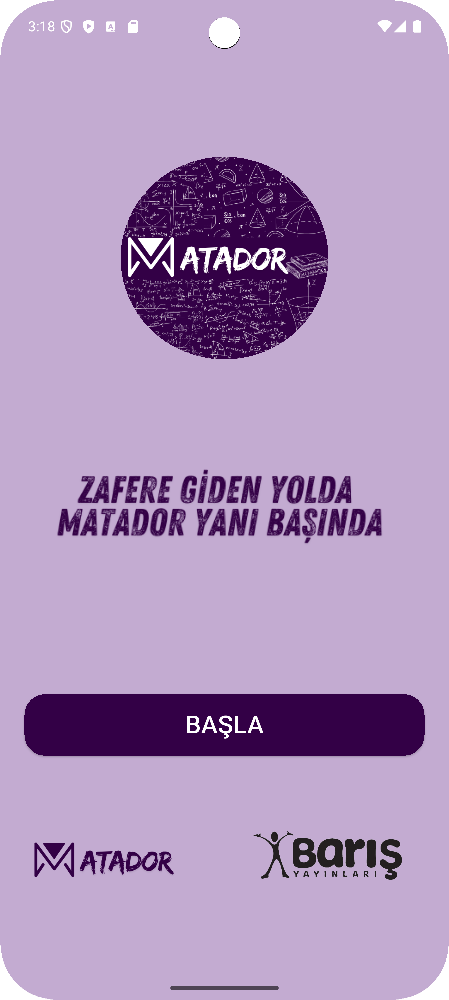<br>
      <b>1️⃣ Giriş Ekranı</b><br>
      <sub>Matador logosu ve hoşgeldiniz mesajı<br>"BAŞLA" butonu ile uygulamaya giriş</sub>
    </td>
    <td align="center" width="33%">
      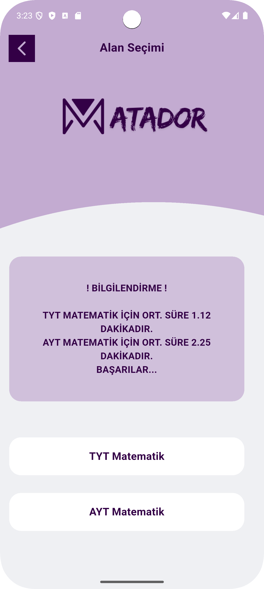<br>
      <b>2️⃣ Alan Seçimi</b><br>
      <sub>TYT ve AYT Matematik seçenekleri<br>Ortalama süre bilgilendirmesi</sub>
    </td>
    <td align="center" width="33%">
      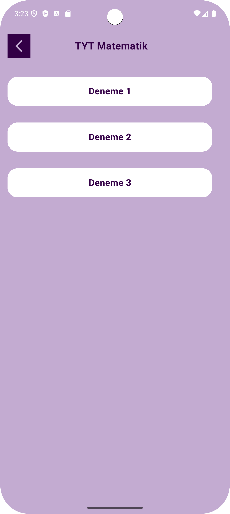<br>
      <b>3️⃣ Test Seçimi</b><br>
      <sub>farklı deneme seçeneği<br>Minimalist ve temiz tasarım</sub>
    </td>
  </tr>
</table>

#### ⏱️ Test Başlangıç ve Soru Çözme

<table>
  <tr>
    <td align="center" width="33%">
      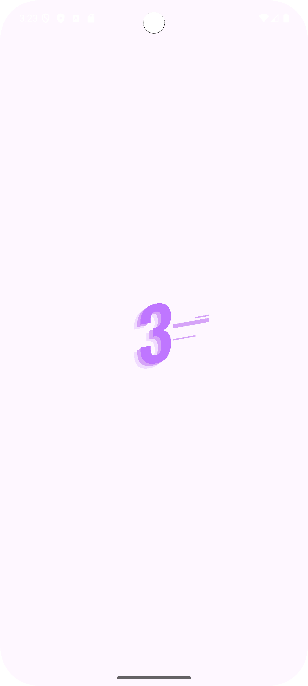<br>
      <b>4️⃣ Countdown Animasyonu</b><br>
      <sub>Lottie animasyonu ile 3-2-1 geri sayım<br>Test öncesi hazırlık</sub>
    </td>
    <td align="center" width="33%">
      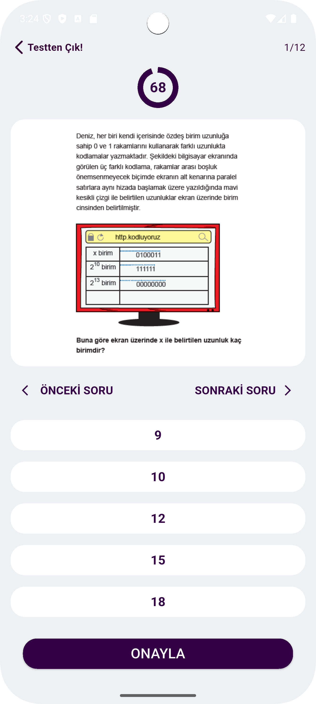<br>
      <b>5️⃣ Soru Ekranı (Boş)</b><br>
      <sub>72 saniyelik circular timer<br>5 şık seçeneği, başlangıç durumu</sub>
    </td>
    <td align="center" width="33%">
      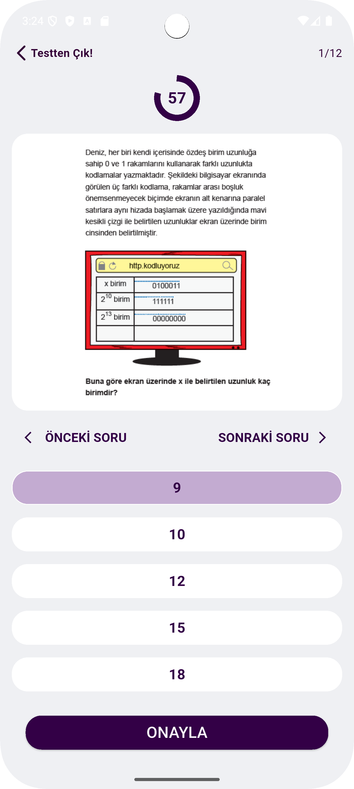<br>
      <b>6️⃣ Soru Ekranı (İşaretli)</b><br>
      <sub>Şık seçilmiş durum (mor renk)<br>Sonraki/Önceki soru navigasyonu</sub>
    </td>
  </tr>
</table>

#### 📚 Farklı Soru Tipleri Örnekleri

<table>
  <tr>
    <td align="center" width="33%">
      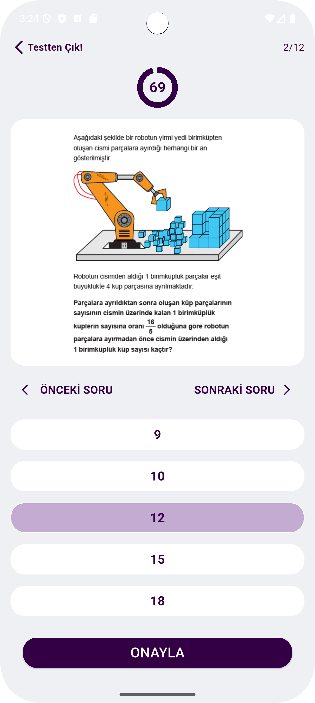<br>
      <b>7️⃣ Farklı Soru</b><br>
      <sub>Görsel destekli problem<br>Cisim parçası örneği</sub>
    </td>
    <td align="center" width="33%">
      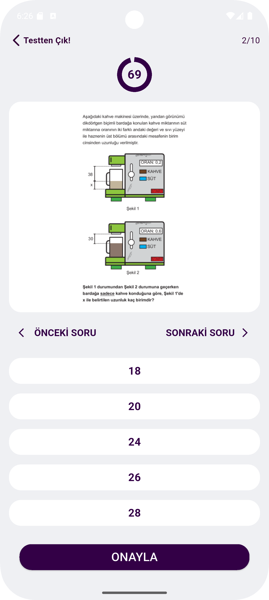<br>
      <b>8️⃣ Farklı Soru</b><br>
      <sub>Matematiksel modelleme<br>Gerçek hayat problemi</sub>
    </td>
    <td align="center" width="33%">
      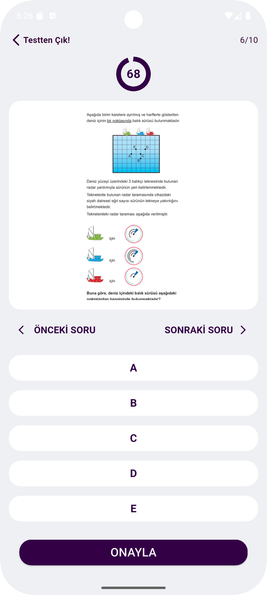<br>
      <b>9️⃣ Farklı Soru</b><br>
      <sub>Koordinat sistemi sorusu<br>Vektör ve konum analizi</sub>
    </td>
  </tr>
</table>

#### 📊 Sonuç ve Kontrol Ekranları

<table>
  <tr>
    <td align="center" width="33%">
      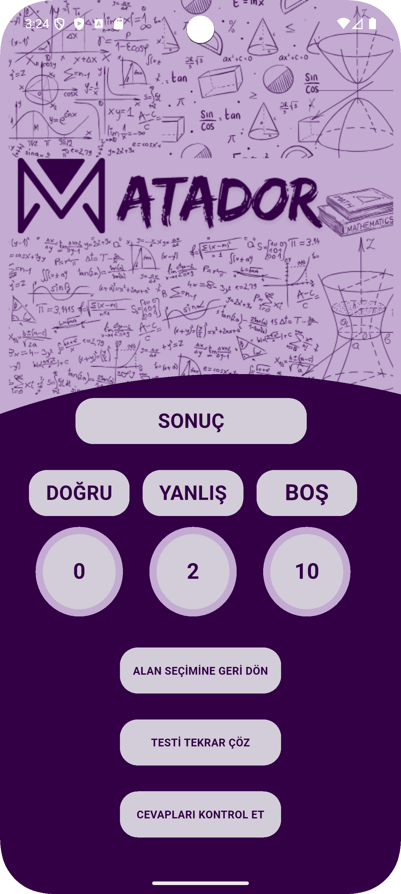<br>
      <b>🔟 Sonuç Ekranı</b><br>
      <sub>Doğru: 0, Yanlış: 2, Boş: 10<br>3 aksiyon butonu (tekrar çöz, kontrol, ana menü)</sub>
    </td>
    <td align="center" width="33%">
      <br>
      <b>1️⃣1️⃣ Kontrol - Soru 1</b><br>
      <sub>Kullanıcı cevabı: Açık mor<br>Doğru cevap: Koyu mor</sub>
    </td>
    <td align="center" width="33%">
      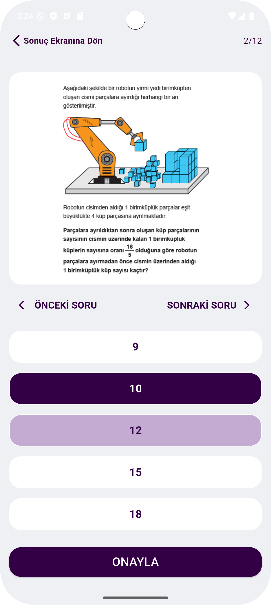<br>
      <b>1️⃣2️⃣ Kontrol - Soru 2</b><br>
      <sub>Yanlış cevap gösterimi<br>Doğru cevap vurgulama</sub>
    </td>
  </tr>
</table>

</div>

### 🎨 Renk Kodları ve Anlamları

<div align="center">

| Renk | Hex Code | Kullanım Alanı |
|:----:|:--------:|:---------------|
| 🟣 **Koyu Mor** | `#330046` | Ana tema, başlıklar, butonlar |
| 🟪 **Açık Mor** | `#C3ABD1` | Seçili şıklar, vurgular, kullanıcı cevabı |
| ⚪ **Beyaz** | `#FFFFFF` | Buton arka planları, kart yüzeyleri |
| ⬜ **Açık Gri** | `#EFF0F3` | Arka plan, content alanları |
| 🟦 **Koyu Mor (Doğru)** | `#330046` | Doğru cevap gösterimi |

</div>

### 📐 Ekran Özellikleri ve Detaylar

| Ekran | Özellikler | Kullanıcı Aksiyonları |
|:------|:-----------|:---------------------|
| **🏠 Giriş** | Logo, slogan, başla butonu | Başla butonuna tıklama |
| **📚 Alan Seçimi** | TYT/AYT seçenekleri, bilgilendirme kutusu | Alan seçimi, geri dönüş |
| **📝 Test Seçimi** | 3 deneme butonu, başlık | Test seçimi, geri dönüş |
| **⏰ Countdown** | Lottie animasyonu (3-2-1) | Otomatik geçiş (3 saniye) |
| **❓ Soru Ekranı** | Timer (72s), görsel soru, 5 şık, sayaç (1/10) | Şık seçimi, ileri/geri, onayla |
| **📊 Sonuç** | Doğru/Yanlış/Boş dağılımı, 3 buton | Tekrar çöz, kontrol et, ana menü |
| **🔍 Kontrol** | Tüm sorular ve cevaplar, renk kodlama | İleri/geri, sonuç ekranına dön |

</div>

---

## 🛠 Teknoloji Stack

### Frontend
- **Framework**: Flutter 3.6.0+
- **Dil**: Dart 3.0+
- **UI/UX**: Material Design, Custom Widgets

### Kullanılan Paketler
```yaml
dependencies:
  flutter: sdk: flutter
  lottie: ^2.7.0                    # Animasyonlar için
  auto_size_text_plus: ^3.0.0       # Responsive text için
  cupertino_icons: ^1.0.8           # iOS stil ikonlar
```

### Tasarım & Geliştirme Araçları
- **UI Tasarım**: Figma
- **IDE**: Android Studio / Visual Studio Code
- **Version Control**: Git
- **Asset Management**: Flutter Asset System

### Platform Desteği
- ✅ Android
- ✅ iOS

---

## 📖 Kullanım

### Uygulama Akışı

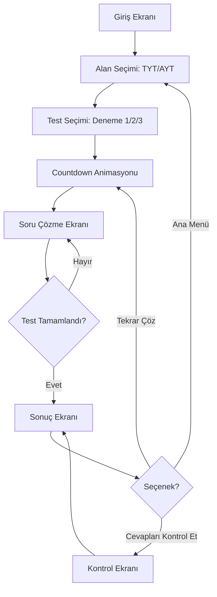

### Kullanıcı Rehberi

1. **Başlangıç**
   - Uygulamayı açın
   - "BAŞLA" butonuna tıklayın

2. **Alan Seçimi**
   - TYT Matematik veya AYT Matematik seçin
   - Bilgilendirme metnini okuyun

3. **Test Seçimi**
   - İstediğiniz denemeyi seçin (1, 2, veya 3)
   - Countdown animasyonu başlar

4. **Soru Çözme**
   - Soruyu okuyun (görsel olarak sunulur)
   - Zamanlayıcıyı takip edin (72 saniye)
   - Şıklardan birini seçin
   - "Sonraki Soru" veya "Önceki Soru" ile navigate edin
   - "ONAYLA" butonu ile testi bitirin

5. **Sonuç**
   - Doğru, Yanlış, Boş sayılarınızı görün
   - "Testi Tekrar Çöz" ile aynı testi tekrar çözün
   - "Cevapları Kontrol Et" ile detayları inceleyin
   - "Alan Seçimine Geri Dön" ile ana menüye dönün

---

## 📂 Proje Yapısı

```
matador_app/
│
├── lib/
│   ├── main.dart                      # Ana giriş noktası
│   ├── giris_ekrani.dart              # Karşılama ekranı
│   ├── alan_secim_ekrani.dart         # TYT/AYT seçim ekranı
│   ├── test_secim_ekrani.dart         # Test seçim ekranı
│   ├── animasyon.dart                 # Countdown animasyon ekranı
│   ├── soru_ekrani.dart               # Soru çözme ekranı
│   ├── soru_kontrol_ekrani.dart       # Cevap kontrol ekranı
│   ├── sonuc_ekrani.dart              # Sonuç gösterim ekranı
│   └── sorular.dart                   # Soru veri yapısı
│
├── assets/
│   ├── matador_logo.png               # Ana logo
│   ├── matador_yazi.png               # Logo yazısı
│   ├── matador_other_logo.png         # Alternatif logo
│   ├── logo4.png                      # Partner logo
│   ├── countdown.json                 # Lottie animasyon
│   ├── zafere_giden_yolda_matador_yani_basinda.png
│   └── sorular/
│       ├── tyt/
│       │   ├── deneme_1/              # TYT Deneme 1 soruları (PNG)
│       │   ├── deneme_2/              # TYT Deneme 2 soruları (PNG)
│       │   └── deneme_3/              # TYT Deneme 3 soruları (PNG)
│       └── ayt/
│           ├── deneme_1/              # AYT Deneme 1 soruları (PNG)
│           ├── deneme_2/              # AYT Deneme 2 soruları (PNG)
│           └── deneme_3/              # AYT Deneme 3 soruları (PNG)
│
├── android/                           # Android yapılandırması
├── ios/                               # iOS yapılandırması
├── pubspec.yaml                       # Proje bağımlılıkları
└── README.md                          # Bu dosya
```

### Önemli Dosyalar

#### `sorular.dart`
```dart
// Soru veri yapısı
final Map<String, Map<String, List<Map<String, dynamic>>>> sorular = {
  'TYT Matematik': {
    'Deneme 1': [
      {
        'question': 'assets/sorular/tyt/deneme_1/deneme_1_soru_1.png',
        'answers': ['1,1', '2,2', '3,3', '4,4', '5,5'],
        'correctAnswer': '3,3',
      },
      // ... diğer sorular
    ],
  },
};
```

---

### Destekleyen Kurum

<p align="center">
  
  &nbsp;&nbsp;&nbsp;&nbsp;
  
</p>

---

## 🏆 TÜBİTAK 2209-A Projesi

Bu proje, **TÜBİTAK 2209-A Üniversite Öğrencileri Araştırma Projeleri Desteği Programı** kapsamında desteklenmektedir.

### Proje Bilgileri

- **Proje Başlığı**: Yükseköğretim Kurumları Giriş Sınavına Hazırlanan Adaylara Yönelik Süre Sınırlamalı Matematik Soruları Çözdüren Mobil Uygulama: MATADOR
- **Program**: TÜBİTAK 2209-A
- **Yıl**: 2024
- **Dönem**: 1. Dönem
- **Kurum**: İstanbul Esenyurt Üniversitesi
- **Destek Türü**: Araştırma Projesi

---

### Tipografi

- **Font**: System Font (Platform default)
- **Başlıklar**: 20-24px, Bold
- **Gövde Metni**: 14-18px, Regular/Bold
- **Butonlar**: 18-24px, Bold

### Responsive Ölçeklendirme

```dart
final double baseWidth = 430;
final double baseHeight = 932;

final scaleX = screenWidth / baseWidth;
final scaleY = screenHeight / baseHeight;
```

---

## 🖼️ Görsel İndeks

Projedeki tüm ekran görüntüleri:

| # | Dosya Adı | Açıklama | Kullanım Yeri |
|:-:|:----------|:---------|:--------------|
| 1 | `giris_ekrani.png` | Hoş geldin ve başlangıç ekranı | Uygulama ilk açılış |
| 2 | `alan_secim_ekrani.png` | TYT/AYT seçim ekranı | Alan seçimi |
| 3 | `test_secim_ekrani.png` | Deneme test seçimi | Test seçimi |
| 4 | `animasyon_ekrani.png` | Countdown animasyonu | Test öncesi hazırlık |
| 5 | `soru_ekrani_soru_1_unmarked.png` | Boş soru ekranı | Soru görüntüleme |
| 6 | `soru_ekrani_soru_1_marked.png` | Cevap işaretlenmiş soru | Cevap seçimi |
| 7 | `soru_ekrani_soru_2_marked.png` | Farklı soru tipi örneği | Soru çeşitliliği |
| 8 | `soru_kontrol_ekrani_soru_1.png` | Doğru cevap kontrolü | Cevap doğrulama |
| 9 | `soru_kontrol_ekrani_soru_2.png` | Yanlış cevap kontrolü | Hata gösterimi |
| 10 | `sonuc_ekrani.png` | Test sonuç ekranı | Performans analizi |
| 11 | `Screenshot_20250418_212646.png` | Gerçek sınav sorusu örnek 1 | Soru kalitesi gösterimi |
| 12 | `Screenshot_20250418_212659.png` | Gerçek sınav sorusu örnek 2 | İçerik zenginliği |

> 💡 **Not**: Tüm görseller `screenshots/` klasöründe bulunmaktadır.


---

## 🔐 Güvenlik & Gizlilik

- ❌ Kullanıcı verisi toplanmaz
- ❌ İnternet bağlantısı gerekmez (offline)
- ❌ Reklam yok
- ❌ İzleme/tracking yok
- ✅ Tamamen yerel çalışma
- ✅ GDPR uyumlu


---

## 🙏 Teşekkürler

Bu projenin geliştirilmesinde desteklerini esirgemeyen:

- **TÜBİTAK** - Proje desteği için
- **Dr. Öğr. Üyesi Ülker BAŞAR** - Değerli danışmanlığı için
- **Barış Yayınları** - Logo ve marka desteği için


---

## 📚 Kaynaklar

### Dokümantasyon
- [Flutter Documentation](https://flutter.dev/docs)
- [Dart Documentation](https://dart.dev/guides)
- [Material Design Guidelines](https://material.io/design)

### Eğitim Kaynakları
- [Flutter YouTube Channel](https://www.youtube.com/c/flutterdev)
- [Dart & Flutter Turkish Community](https://flutter-tr.github.io/)
- [Flutter Cookbook](https://docs.flutter.dev/cookbook)

### Kullanılan Teknolojiler
- [Figma](https://www.figma.com/) - UI/UX tasarım
- [Lottie](https://lottiefiles.com/) - Animasyonlar
- [Flutter Launcher Icons](https://pub.dev/packages/flutter_launcher_icons)

---

<div align="center">

---

**🎓 Zafere Giden Yolda MATADOR Yanı Başında! 🎓**

[](https://flutter.dev)
[](https://tubitak.gov.tr)
[](LICENSE)

**© 2024 MATADOR Team - İstanbul Esenyurt Üniversitesi**

</div>
